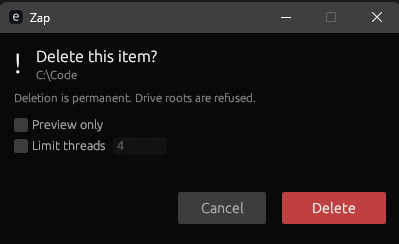

# Zap

Fast Windows deletion from Explorer, with a confirmation dialog by default and
a windowless immediate-delete action when you need it.

<p align="center">
  
</p>

<p align="center">
  
</p>

Zap removes large directory trees faster than the default Windows delete flow by
combining parallel directory scanning with multi-threaded file removal. The main
workflow is Explorer-first: right-click selected files or folders, choose Zap,
then pick the safe GUI confirmation flow or the silent immediate-delete action.

## Features

- **Explorer-first GUI** — `Zap -> Delete...` opens a compact confirmation dialog.
- **Windowless delete** — `Zap -> Zap Delete` deletes the selection without a GUI or terminal window.
- **Multi-select support** — Explorer selections are batched into one coordinated operation.
- **Fast deletion engine** — `jwalk` scans directories in parallel and `rayon` removes files concurrently.
- **Safety guards** — filesystem roots are refused, protected paths are blocked, and symlinks/junctions are never traversed.
- **Read-only recovery** — read-only attributes are cleared and deletion is retried when possible.
- **Filter support** — glob pattern filtering, size filtering, and date-based filtering.
- **Secure deletion** — overwrite files with random data before removing (`--shred`), also available as a checkbox in the GUI.
- **Recycle Bin** — send to Recycle Bin instead of permanent delete (`--recycle`). Multiple items are moved with a single shell call — one Explorer "Undo" restores everything.

## Installation

Download `Zap.exe` from the [latest GitHub release](https://github.com/adxptived/zap/releases/latest),
or install with PowerShell:

```powershell
irm https://raw.githubusercontent.com/adxptived/zap/master/dist/install.ps1 | iex
```

The installer adds the Zap submenu to Windows Explorer and installs:

- `zapg.exe` for the default GUI confirmation action.
- `zapw.exe` for the windowless **Zap Delete** action.
- `zap.exe` for optional terminal use.

To uninstall, use the Start Menu uninstaller. To remove only the Explorer menu:

```powershell
%APPDATA%\zap\bin\unregister-context-menu.exe
```

## Explorer Usage

After installation, right-click any file, folder, or Explorer background and
open the **Zap** submenu.

| Menu item | Behavior |
| --- | --- |
| **Delete...** | Opens the GUI confirmation dialog. This is the default and safest flow. |
| **Zap Delete** | Deletes immediately with no GUI and no terminal window. |

The GUI dialog supports:

- **Preview only** to scan without deleting.
- **Limit threads** to cap Rayon worker threads.
- Automatic close after successful destructive deletion.
- Visible failure state when deletion cannot complete.

## Optional Terminal Usage

The terminal interface is secondary. Use it for scripts, automation, or manual
debugging.

```shell
zap [FLAGS] [OPTIONS] <path>...
zap --help
zap --version
```

| Flag | Description |
| --- | --- |
| `--yes`, `--force` | Required for destructive terminal deletion. |
| `--dry-run` | Preview without removing files. |
| `--threads N`, `-j N` | Override the Rayon worker thread count. |
| `--silent` | Suppress progress output. Used by `zapw.exe`. |
| `--batch` | Internal Explorer multi-select coordination flag. |
| `--shred` | Overwrite files with random data before deleting (3 passes). Note: file names/MFT records are not wiped, and on SSDs wear-leveling means overwrites are best-effort. |
| `--only-empty` | Only delete if the directory is empty. |
| `--recycle` | Send to Recycle Bin instead of permanent delete (also a checkbox in the GUI dialog and an Explorer context-menu entry). Batched: one shell call / one Undo for the whole selection. |
| `--no-size-preview` | Show the confirmation prompt immediately without calculating preview sizes. Useful for huge trees where sizing would feel like a hang. |
| `--include GLOB` | Only delete paths matching glob pattern (repeatable). |
| `--exclude GLOB` | Skip paths matching glob pattern (repeatable). |
| `--min-size SIZE` | Only delete files larger than SIZE (bytes, or `10k`, `5mb`, `1.5g`, `2tb`). |
| `--newer-than WHEN` | Only delete files newer than a date/time (RFC 3339) or age (e.g. `12h`, `30d`). |
| `--older-than WHEN` | Only delete files older than a date/time (RFC 3339) or age (e.g. `12h`, `30d`). |
| `--` | Treat every following argument as a path (for names starting with `-`). |

Examples:

```shell
zap --dry-run "C:\temp\build-output"
zap --yes "C:\temp\build-output"
zap --yes --threads 4 "C:\temp\huge-repo"
zap --no-size-preview "C:\temp\huge-repo"
zap --yes --shred "C:\temp\secret-files"
zap --yes --exclude "*.log" --min-size 10mb "C:\temp\project"
zap --yes -- "-weird-folder-name"
```

## Safety Model

Zap is destructive, so the deletion engine keeps several guardrails in place:

- Drive roots such as `C:\` and `D:\` are always refused.
- Known system and profile roots are protected.
- Symlinks and junctions are removed as links only; targets are not traversed.
- Read-only files and directories are retried after clearing the read-only flag.
- The GUI keeps the dialog open when deletion fails so the error remains visible.
- `--recycle` is also subject to protection guards (cannot recycle system paths).

Protected examples include:

- `C:\Windows`
- `C:\Program Files`
- `C:\ProgramData`
- `C:\Users`
- user profile roots and well-known folders such as `Desktop`, `Documents`, `Downloads`, `AppData`
- `C:\System Volume Information`
- `C:\Recovery`

## Build From Source

Prerequisites:

- Rust toolchain with the MSVC target.
- Python with PyInstaller on `PATH`.
- Inno Setup 6.

```shell
git clone https://github.com/adxptived/zap.git
cd zap
cargo build --profile release-optimized
```

Build the full Windows release package:

```bat
rebuild.bat
```

The installer is written to:

```text
dist\output\Zap.exe
```

## Development

```shell
cargo fmt
cargo clippy --all-targets -- -D warnings
cargo test
```

Useful build scripts:

| Script | Purpose |
| --- | --- |
| `rebuild.bat` | Non-interactive full release pipeline. |
| `rebuild-ui.bat` | Interactive build menu for local development. |
| `rebuild.ps1` | Shared PowerShell build pipeline. |

Generated paths:

- `target/` — Cargo output.
- `build/` — PyInstaller work files.
- `bin/` — staged release binaries.
- `dist/output/` — final installer output.

## Project Layout

```text
src/
  main.rs                  Console CLI and batch coordination
  cli.rs                   Argument parser
  delete.rs                Core deletion engine
  scan.rs                  Directory walking and entry classification
  protect.rs               Protected path checks
  filter.rs                Glob pattern and metadata filtering
  recycle.rs               Recycle Bin integration
  shred.rs                 Secure deletion (overwrite with random data)
  size.rs                  Directory size calculation
  stop.rs                  Global graceful-stop signal
  path_utils.rs            Path formatting and dedup helpers
  batch.rs                 Multi-process Explorer batch coordination
  treemap.rs               Treemap visualization for GUI
  winapi.rs                Windows API helpers
  bin/
    zapg/                  Explorer GUI confirmation dialog
      main.rs              Entry point, args, batch coordinator election
      app.rs               Dialog state and background workers
      ui.rs                Theme and rendering
    zapw.rs                Windowless immediate-delete binary

assets/
  branding/                Logo and installer icon
  screenshots/             README and release screenshots
  manifests/               UAC manifests for Explorer-launched binaries

dist/
  zap.iss                  Inno Setup installer script
  install.ps1              Remote install script
  register-context-menu.*  Explorer menu registration helpers
  unregister-context-menu.* Explorer menu removal helpers
```

## Release Artifact

- Installer: `dist\output\Zap.exe`
- SHA256: `01DE05E6F357BA1CF97AF0355E1D63556D3945F811E941EA0BF866DEACE91743`

## License

Apache-2.0. See [LICENSE.txt](LICENSE.txt).
